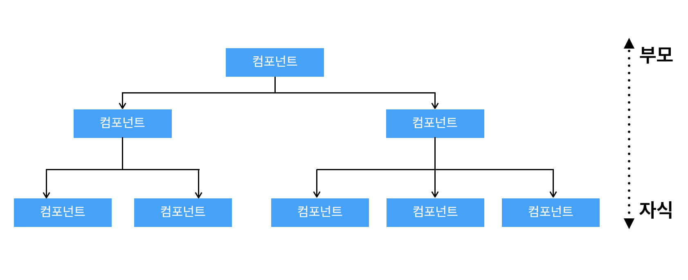
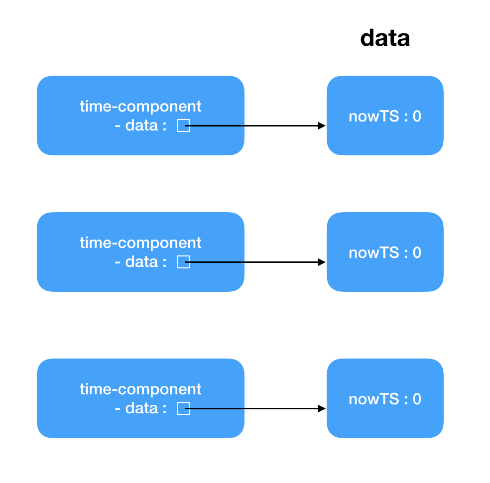
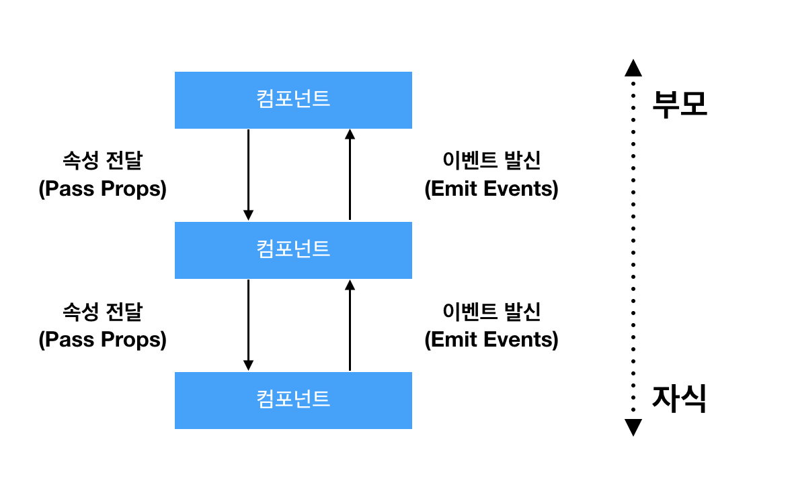

# Chapter6 컴포넌트 기초


### 1. 컴포넌트의 조합
Vue.js는 컴포넌트들을 조합해 하나의 애플리케이션을 만든다.<br>
조합된 컴포넌트들은 부모-자식 관계인 트리 구조를 형성하며
부모와 자식 컴포넌트 간의 정보 전달은 props와 event를 사용하여 정보를 전달한다.
</img>


### 2. 컴포넌트의 작성
~~~javascript
Vue.component(tagname, options)
~~~
* __tagname__: 컴포넌트를 사용할 태그명이다.
* __options__: 컴포넌트에서 렌더링할 template 등을 지정한다.

```tagname```은 대소문자를 구분하지 않기 때문에 파스칼(pascal)/카멜(camel) 표기법이 아닌 케밥(kebob) 표기법을 사용한다.<br>
```options```는 Vue 인스턴스의 옵션과 같이 data, methods, computed, watch 옵션을 사용할 수 있다.<br>
Vue componet를 렌더링하기 위해서는 하나의 Vue 인스턴스(```new Vue()```)가 생성되어야 한다.

> example: 인라인(템플릿 옵션에 템플릿 문자열을 사용) 템플릿을 사용한 예제
> ~~~html
> <div id="app">
>     <hello-component></hello-component>
>     <hello-component></hello-component>
>     <hello-component></hello-component>
> </div>
>
> <script type="text/javascript">
>     Vue.component('hello-component', {
>       template: '<div>hello world</div>',
>     });
>
>     var v = new Vue({
>       el: '#app',
>     });
> </script>
> ~~~

> example: 템플릿 문자열을 포함하고 있는 ```<template>``` 태그를 사용한 예제
> ~~~html
> <div id="app">
>     <hello-component></hello-component>
>     <hello-component></hello-component>
>     <hello-component></hello-component>
> </div>
>
> <template id="helloTemplate">
>     <div>hello world!!!</div>
> </template>
> <script type="text/javascript">
>     Vue.component('hello-component', {
>         template: '#helloTemplate',
>     });
>
>     var v = new Vue({
>       el: '#app',
>     });
> </script>
> ~~~

> example: 템플릿 문자열을 포함하고 있는 ```<script type="text/x-template">``` 태그를 사용한 예제
> ~~~html
> <div id="app">
>     <hello-component></hello-component>
>     <hello-component></hello-component>
>     <hello-component></hello-component>
> </div>
>
> <script type="text/x-template" id="helloTemplate">
>     <div>hello world!!!</div>
> </script>
> <script type="text/javascript">
>     Vue.component('hello-component', {
>         template: '#helloTemplate',
>     });
>
>     var v = new Vue({
>       el: '#app',
>     });
> </script>
> ~~~


### 3. DOM 템플릿 구문 작성 시 주의 사항
##### 자식노드를 포함하는 요소에 대한 Vue 컴포넌트의 오류
- HTML 요소들은 자식 요소를 포함 시킬 수 있으며 어떤 요소들은 자식 요소가 정해져 있는 경우가 있다.
- 아래 예제를 살펴보면 ```<select>``` 요소는 ```<option>``` 요소를 필수 자식 노드로 가지게 되는데
코드 상에는 ```<option-component>``` 컴포넌트가 자식 노드로 배치되어 있다. 이 경우 Vue 컴포넌트를
렌더링하기 전 구문 분석을 수행하게 되는데 구문 분석 단계에서 DOM 요소가 올바르지 않다고 판단하고
정상적인 렌더링을 수행하지 못하는 문제가 발생하게 된다.
~~~html
<div id="app">
    <select>
        <option-component></option-component>
        <option-component></option-component>
    </select>
</div>

<script type="text/javascript">
    Vue.component('option-component', {
      template: '<option>hello</option>'
    });

    var v = new Vue({
      el: '#app',
    });
</script>
~~~
- 이 문제를 해결하기 위해서는 is 속성을 사용하면 된다.
~~~html
<select>
    <option is="option-component"></option>
    <option is="option-component"></option>
</select>
~~~
- .vue 확장자를 사용하는 단일 파일 컴포넌트(Single File Component)를 작성하는 경우에는 사용하지 않아도 된다.
- ```<template>``` 태그를 사용할 때는 is 속성을 사용해야 한다.

##### 템플릿 문자열 안에는 Root Element는 반듯이 하나여야 함
* 여러개의 Root Element가 존재할ㅡ경우 오류가 발생함으로 ```<div>```로 한 번 더 감싸주어 오류를 해결할 수 있다.


> 오류가 발생하는 코드
> ~~~html
> <template id="helloTemplate">
>     <div>hello</div>
>     <div>hello</div>
> </template>
> ~~~

> 정상적으로 동작하는 코드
> ~~~html
> <template id="helloTemplate">
>     <div>
>         <div>hello</div>
>         <div>hello</div>
>     </div>
> </template>
> ~~~


### 4. 컴포넌트에서의 data 옵션
* 컴포넌트 내부의 로컬 상태 정보를 저장하기 위해 data 옵션을 사용한다.
* data 옵션에 리터럴 객체를 작성하면 오류가 발생한다.
* data 옵션이 정상적으로 렌더링되기 위해서는 함수가 호출되어 객체가 리턴되게 한다.
* 함수 호출 시 리턴된 객체는 컴포넌트 각각 data가 서로 다른 객체를 참조하게 된다.
> example: data 옵션에 객체를 리턴하는 함수를 작성한 예제
> ~~~html
> <div id="app">
>     <time-component></time-component>
>     <time-component></time-component>
> </div>
> <div><a href="../">목록</a></div>
>
> <template id="timeTemplate">
>     <div>
>         <span>{{nowTS}}</span>
>         <button v-on:click="timeClick">현재 시간</button>
>     </div>
> </template>
> <script>
>     Vue.component('time-component', {
>       template: '#timeTemplate',
>       data: function() {
>         return { nowTS: 0 }
>       },
>       methods: {
>         timeClick: function(e) {
>           this.nowTS = (new Date()).getTime();
>         }
>       },
>     });
>
>     var v = new Vue({
>       el: '#app',
>     });
> </script>
> ~~~
</img>


### 5. props와 event
* Vue 컴포넌트는 부모-자식 관계로 형성되어 있으며 각 컴포넌트 내부의 데이터는 캡슐화되어 있어
다른 컴포넌트나 앱에서 접근할 수가 없다. 따라서 부모 컴포넌트에서 자식 컴포넌트로 필요한 정보를 전달하기 위해서는
```props```를 이용하여 정보를 전달하며 자식 컴포넌트에서 부모 컴포넌트로 정보를 전달할 때는 ```emit```으로
이벤트를 발생시키고 이벤트 객체를 이용하여 정보를 전달하게 된다.
</img>


### 6.이벤트 버스 객체를 이용한 통신
